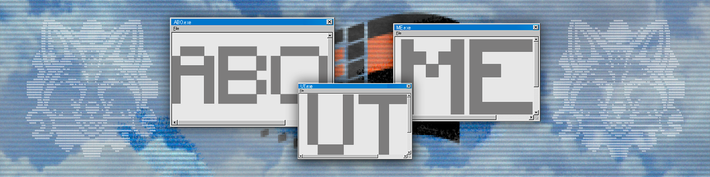
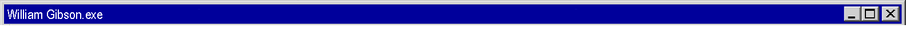
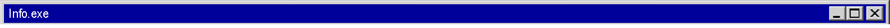
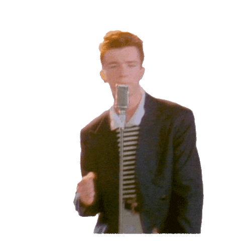
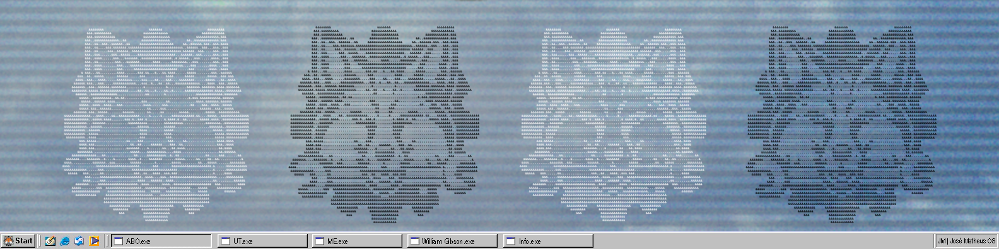

  
  </a>

#

Olá! Me chamo José e sou estudante de Ciência da Computação na Universidade Tiradentes - UNIT (4º período).
Meu GitHub é uma demonstração dos projetos que desenvolvo e posso desenvolver, algumas soluções simples e outras mais complexas (Muitas vezes, mais do que deveriam), sempre buscando soluções bem estruturadas e eficientes.

Tenho interesse em explorar novas tecnologias e aprimorar constantemente minhas habilidades, aplicando lógica e criatividade no desenvolvimento de software.

📩 Para contato, sinta-se à vontade para me chamar!

##

Hello! My name is José, and I am a Computer Science student at Universidade Tiradentes - UNIT (4nd semester).
My GitHub is a showcase of the projects I develop and can develop—some simple solutions and others more complex (often more than they should be), always aiming for well-structured and efficient solutions.

I have a strong interest in exploring new technologies and continuously improving my skills, applying logic and creativity to software development.

📩 Feel free to reach out!

  "O céu sobre o porto tinha a cor de uma televisão sintonizada num canal fora do ar."

  – <i>Neuromancer, 1991</i> 
  Edição brasileira pela Editora Aleph.

  "The sky above the port was the color of television, tuned to a dead channel."

  – <i>Neuromancer, 1984</i>
  Original edition by Ace Books.

#

 

<h3 align="left">// Connect with me! | Conecte-se comigo!</h3>

<h3 align="left">// Always Learning | Constantemente Aprendendo</h3>

  
  
  

#

