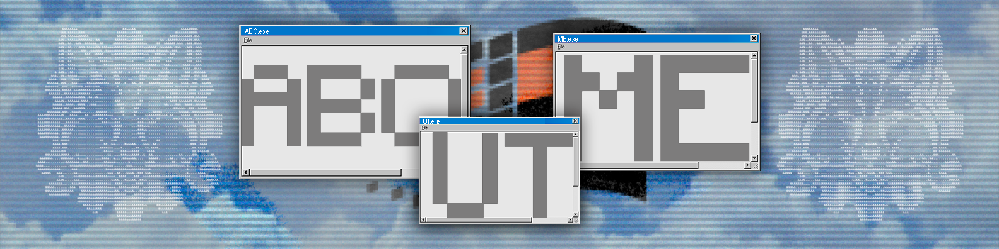
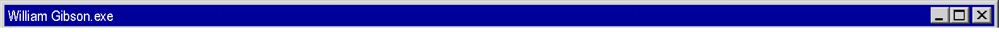
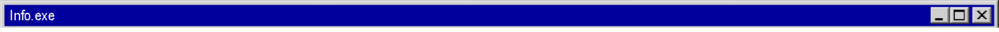
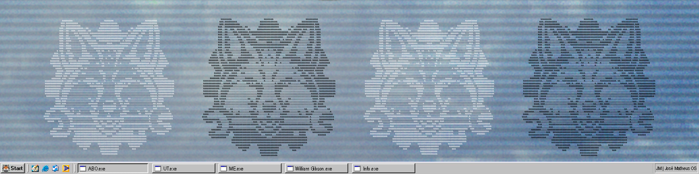

  
  </a>

#

Me chamo **José Matheus**, **estudante de CS** e **desenvolvedor de software** que constrói coisas que ~provavelmente~ não deveriam existir.

##

My name is **José Matheus**, **CS student** and **software developer** who builds things that ~probably~ shouldn't exist.

#

  "O céu sobre o porto tinha a cor de uma televisão sintonizada num canal fora do ar."

  – <i>Neuromancer, 1991</i> 
  Edição brasileira pela Editora Aleph.

  "The sky above the port was the color of television, tuned to a dead channel."

  – <i>Neuromancer, 1984</i>
  Original edition by Ace Books.

#

 

<h3 align="left">// Connect with me! | Conecte-se comigo!</h3>

<h3 align="left">// Always Learning | Constantemente Aprendendo</h3>

  
  
  

#

